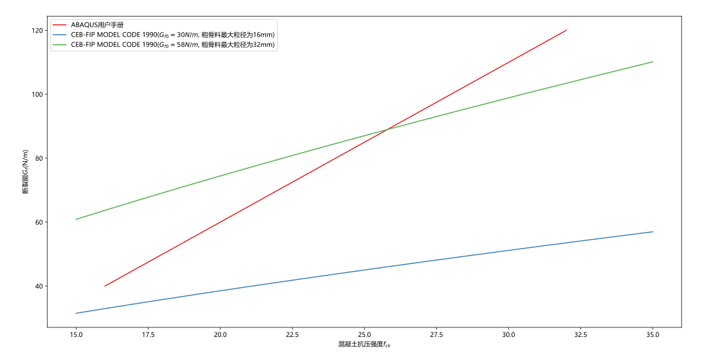
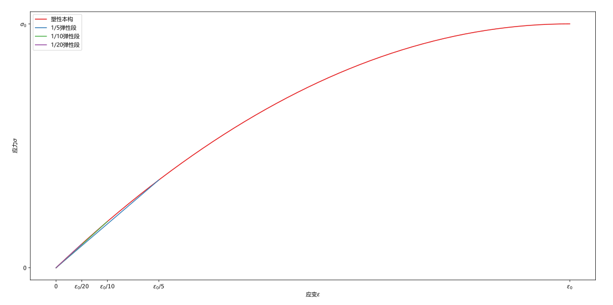
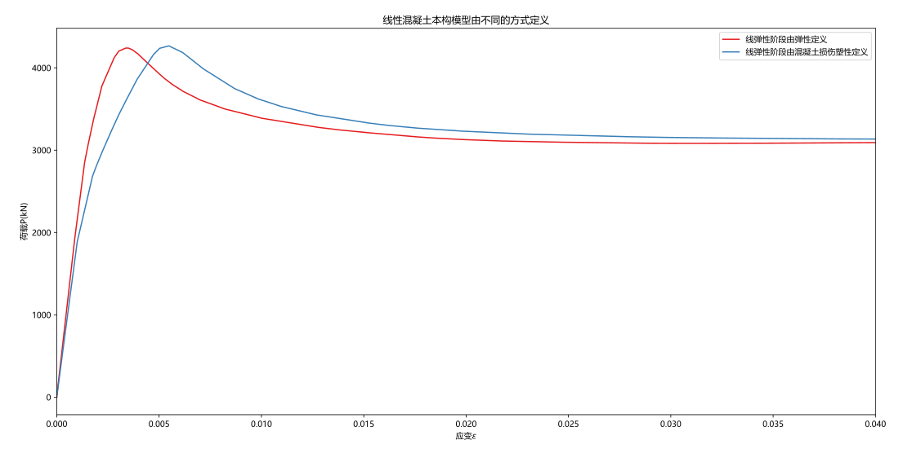
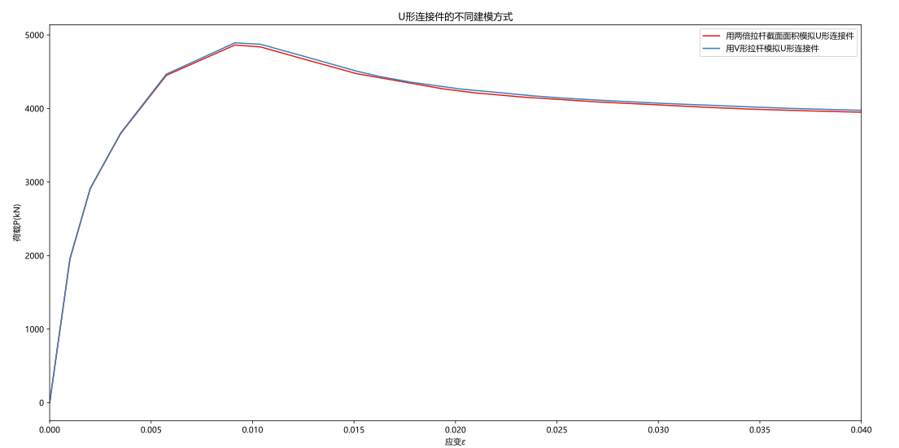
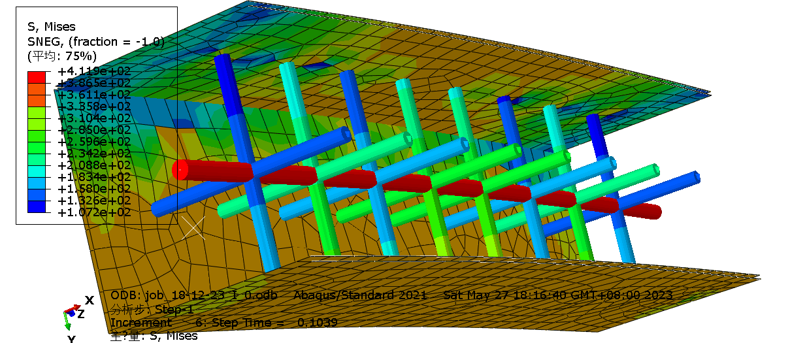
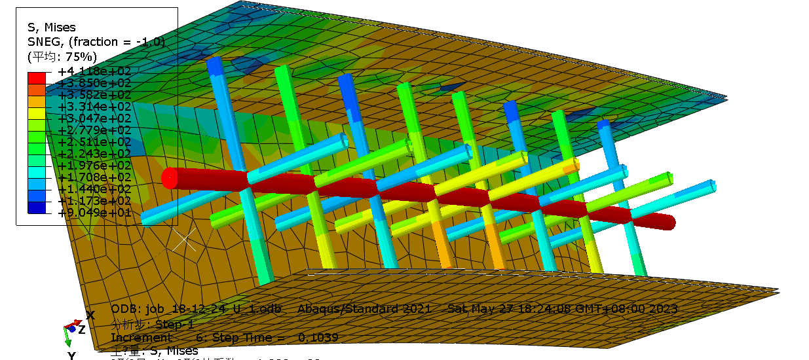
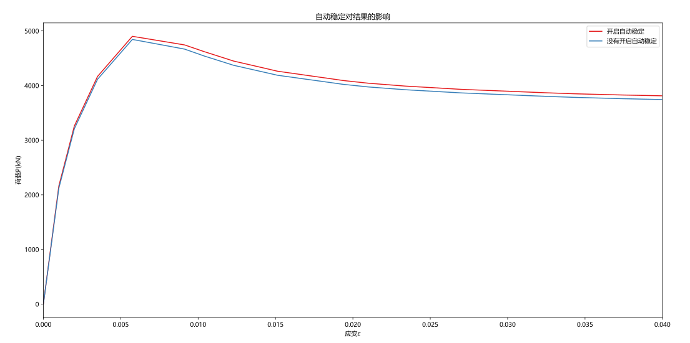

# 材料数据

| 数据           | 来源                             |
| -------------- | -------------------------------- |
| steel.json     | 《钢结构设计标准》GB 50017——2017 |
| concrete.json  | 混凝土结构设计原理(第5版)        |
| steel_bar.json | 混凝土结构设计原理(第5版)        |

混凝土质量密度取2350, 钢材密度取7850

# 部件

| 部件     | 类型                                                     |
| -------- | -------------------------------------------------------- |
| 钢板     | 壳（截面：均质，采用9个节点的Simpson积分）               |
| 混凝土   | 实体（截面：均质）                                       |
| 约束拉杆 | 线（截面：桁架）（网格划分中要再指定一次网格类型为桁架） |
| 中心立杆 | 线（截面：桁架）                                         |

# 材料

## 钢材（钢管）

* 简化四折线二次流塑模型[^1]

$$
\sigma = \left\{\begin{matrix}
E_a \varepsilon &
\varepsilon \in [0,\varepsilon_{ay}]\\

f_{ay} & 
\varepsilon \in \left(\varepsilon_{ay},10\varepsilon_{ay}\right]\\

f_{ay} + \frac{f_{au}-f_{ay}}{90\varepsilon_{ay}}(\varepsilon - 10\varepsilon_{ay}) &
\varepsilon \in \left(10\varepsilon_{ay},100\varepsilon_{ay}\right]\\

f_{au} &
\varepsilon \in \left(100\varepsilon_{ay},+\infin\right)\\
\end{matrix}\right. \qquad \qquad (3-1)\\\\
式中:
\left\{\begin{matrix}
f_{ay} & 钢材屈服强度 & 单位:Mpa\\
\varepsilon_{ay} & 钢材屈服应变, \varepsilon_{ay} = f_{ay} / E_a & 单位:1\\
E_a & 钢材的弹性模量& 单位:Mpa\\
f_{au} & 钢材的极限抗拉强度& 单位:Mpa
\end{matrix}\right.
$$

| 泊松比 | 弹性模量           |
| ------ | ------------------ |
| 0.25   | $2.06 \times 10^5$ |

## 钢筋（约束拉杆/中心立杆）

* 二折线模型[^1]

$$
\sigma = 
\left\{\begin{matrix}
E_s \varepsilon & \varepsilon \in [0,\varepsilon_y]\\
f_y + 0.01 E_s (\varepsilon - \varepsilon_y) & \varepsilon \in (\varepsilon_y, +\infin)
\end{matrix}\right. \qquad \qquad (3-2)\\
\\
式中:
\left\{\begin{matrix}
f_{y} & 约束拉杆屈服强度 & 单位:MPa\\
\varepsilon_{y} & 约束拉杆屈服应变, \varepsilon_{y} = f_{y} / E_s & 单位:1\\
E_s & 约束拉杆的弹性模量 & 单位:MPa\\
\end{matrix}\right.
$$

| 泊松比 | 弹性模量        |
| ------ | --------------- |
| 0.25   | $2 \times 10^5$ |

## 混凝土

### 受压塑性行为（塑性损伤模型CDP）

适用于带约束拉杆的方形、矩形混凝土柱有限元分析混凝土应力-应变关系[^1]。

ABAQUS中需要定义弹性段，其弹性模量取混凝土屈服应力和屈服应变的比值，屈服应变取一个小值，使混凝土立刻进入塑性段。

> * ==[未解决的问题]==「不带约束拉杆CFST」的应力-应变关系也能用这个本构模型吗?


$$
y = \left\{\begin{matrix}
2x - x^2 & (x\le 1)\\
\frac{x}{\beta_0(x-1)^{\eta} + x} & (x>1)
\end{matrix}\right. \qquad \qquad (3-3)\\
\\
式中:
\left\{\begin{matrix}
x = \frac{\varepsilon}{\varepsilon_0} &
y = \frac{\sigma}{\sigma_0}\\

\sigma_0 = f_c' & E_c = 4730 \sqrt{f_c'}\\

{\color{blue}\xi} = \frac{A_sf_y}{A_c f_{ck}}&
{\color{red}\zeta} = \frac{{\color{green}n_b} {\color{green}A_b} {\color{green}f_{yb}}}{(D_c + B_c){\color{green}b_s} f_{ck}}\\

\varepsilon_c = (1300 + 12.5f_c') \times 10^{-6} & 
\varepsilon_0 = \varepsilon_c + 800 {\color{blue}\xi}^{0.2} (1+48.5 {\color{red}\zeta} )\times 10^{-6}\\


\eta = 1.6 + \frac{1.5}{x} &
\beta_0 = \frac{(f_c')^{0.1}}{1.2 \sqrt{1+{\color{blue}\xi}} \sqrt{1+2{\color{red}\zeta}}} \\


\end{matrix}\right.\\
\\
式中:
\left\{\begin{matrix}
D_c & 柱核心混凝土截面长边边长 & 单位:mm\\
B_c & 柱核心混凝土截面短边边长 & 单位:mm\\
A_c & 核心混凝土面积 & 单位:mm^2\\
A_s & 带约束拉杆的方形、矩形钢管混凝土柱截面钢管面积 & 单位:mm^2\\
f_y & 钢管屈服强度 & 单位:MPa\\
f_c' & 核心混凝土圆柱体抗压强度 & 单位:MPa\\
f_{ck} & 核心混凝土轴心抗压强度 & 单位:MPa\\
{\color{blue}\xi} & 钢管约束系数(紧箍系数) & 单位:1\\
{\color{red}\zeta} & 约束拉杆约束系数 & 单位:1\\
{\color{green}b_s} & 柱纵向约束拉杆的间距 & 单位:mm\\
{\color{green}n_b} & 柱在{\color{green}b_s}范围内约束拉杆的根数 & 单位:1\\
{\color{green}A_b} & 单根约束拉杆的面积 & 单位:mm^2\\
{\color{green}f_{yb}} & 约束拉杆 的抗拉强度 & 单位:MPa\\

\end{matrix}\right.
$$

---

「$f_{ck}$与$f_c'$转换表」来源未知（**未使用**），建模中采用$f_{c}'=1.25f_{ck}$近似取值。

$$
f_{ck}与f_c'转换表\\
\left.\begin{array}{|c|c|}\hline
强度等级 & C30 & C40 & C50 & C60 & C70 & C80 & C90\\\hline
f_{ck}(书: 混凝土设计原理)/MPa & 20.1 & 26.8 & 32.4 & 38.5 & 44.5 & 50.2 & 64 \\\hline
f_{ck}/MPa & 20 & 26.8 & 33.5 & 41 & 48 & 56 & 64 \\\hline
f_{c}'/MPa & 24 & 33 & 41 & 51 & 60 & 70 & 80\\\hline
\end{array}\right.
$$

### 混凝土行为其他参数（塑性损伤模型CDP）

来源[^2][^3]

| 膨胀角（$\psi$） | 偏心率（$\lambda$） | fb0/fc0（$\sigma_{b0}/\sigma_{c0}$） | K（$K_c$） | 黏性系数（$\mu$） |
| ---------------- | ------------------- | ------------------------------------ | ---------- | ----------------- |
| 40               | 0.1                 | 1.16                                 | 0.6667     | 0.0005            |

* 屈服准则参数
  * $\sigma_{b0}/\sigma_{c0}$——混凝土双轴与单轴极限抗压强度之比
  * $K_c$——拉伸子午面上与压缩子午面上的第二应力不变量之比（控制混凝土屈服面在偏平面上的投影形状的参数）
* 流动法则参数
  * $\psi$——混凝土屈服面在强化过程中的膨胀角（单位：°）
  * $\lambda$——混凝土塑性势函数的偏心距
* 泊松比取0.2

### 混凝土拉伸行为（断裂能GFI）

在塑性损伤模型中定义断裂能以模拟混凝土拉伸软化。

断裂能按照欧洲规范[^4]的取值为见下式（$f_{cm}$视作$f_c$），断裂应力取混凝土抗拉强度设计值。
$$
G_F = G_{F0} (f_{cm}/f_{cmo})^{0.7}\\
f_{cmo} = 10MPa\\
G_{F0} = 30N/m(混凝土粗骨料最大粒径为16mm)
$$

# 边界条件

## 相互作用

* 钢部件（约束拉杆-中心立杆-钢管）
  * 装配中合并（Merge）
* 钢管-混凝土（表面与表面接触（钢管为主平面））
  * 法向行为——硬接触（允许相互作用过程中分离）
  * 切向行为——摩擦（罚函数，摩擦系数=0.6）
* 钢筋（约束拉杆-中心立杆）-混凝土（内置区域）

> * [「Tie」和「Assembly的Merge」的区别](https://www.bilibili.com/video/BV1QW4y167ok)

## 荷载

* 加载端
  * 在底部创建一个参考点
  * 将参考点、混凝土底面、钢管底边三者，在相互作用中设置为刚体
  * 对底部参考点设置约束（可以设置加载位移）
  * （顶部同理）

# 性能

## 分析步

* 记得开「几何非线性」（因为不是线弹性小变形）
* 可以开自动稳定（有些桁架的线单元（比如U型杆、中心立杆）会局部失稳导致无法收敛（最小增量步不断减小），自动稳定会消除掉这些额外的动能）
  * 使用前一通用分析步的阻尼因子——0.05
* 时间长度设为1（静力加载中时间长度影响不大）
* 增量步
  * 「最大增量步数」取一个比较大的值（1000一般够用，避免步数不够用）
    * 增量步大小「初始」值一般选时间长度的$10^{-2}$倍
    * 「最小值」取$10^{-6}$倍（模型不好收敛时，ABAQUS会不断尝试更小的增量步，跌破最小值时会报错。虽然这个值越小越好，但运行中增量步有不断萎缩的趋势，模型多半无法收敛。）
    * 「最大值」可以取时间长度
* 场输出
  * 预选默认值
* 历程输出
  * 用两个参考点创建为集，历程输出中选择这个集，并输出所有约束反力和位移


## 网格

* 主表面（一般是单元刚度更大的平面）的网格要比从表面更大，这样更好收敛（这条来源未知，实际影响不明显）
* 要为杆件指定为桁架单元类型

## 作业

* 监控出现1U、2U、3U、4U、5U是不收敛的前兆
* ABAQUS使用NVIDIA GPU加速需要安装CUDA并修改abaqus的配置文件，钢管混凝土在一般网格划分下（横截面40个网格左右）模型仍比较小，一般只会提高GPU的显存占用。当模型比较大时（横截面100+网格）才会对GPU有比较高的利用。
* CPU并行数量不一定要用完电脑所有的CPU，保留一两个让系统使用对性能影响不大，同时减少系统崩溃的可能。安装完成CUDA后，GPU并行数量可以设为1。

# 进阶说明

## 关于混凝土本构的「断裂能」取值

由于本仓库主要研究小偏压状态（几乎全截面受压）下的柱子，「断裂能」的取值对结果影响甚微。

文献[^1]使用<u>ABAQUS用户手册</u>的取值，但因为未能在手册找到相应章节，所以没有使用该参数。
$$
\left.\begin{matrix}

\left.\begin{array}{|c|c|}\hline
混凝土圆柱体抗压强度f_c' & 20MPa & 20MPa\sim 40MPa & 40MPa\\\hline
断裂能G_f &  40N/m & 线性插值 & 120N/m\\\hline
\end{array}\right.\\
混凝土破坏应力 \sigma_{to} = 0.1f_c'\\
f_c' 为核心混凝土圆柱体抗压强度

\end{matrix}\right.
$$

欧洲规范[^4]的取值为见下式。（$f_{cm}$视作$f_c$）
$$
G_F = G_{F0} (f_{cm}/f_{cmo})^{0.7}\\
f_{cmo} = 10MPa\\
G_{F0} = \left\{\begin{matrix}
25N/m & 混凝土粗骨料最大粒径为8mm\\
30N/m & 混凝土粗骨料最大粒径为16mm\\
58N/m & 混凝土粗骨料最大粒径为32mm\\
\end{matrix}\right.\\
$$


## 「混凝土屈服应力」选取

在塑性本构模型[^1]中, 混凝土的峰值应变和峰值应力都会被钢管和约束拉杆等因素影响，弹性段的弹性模量也受到明显影响。为了使得混凝土尽快使用塑性本构模型，其弹性段越短越好。但弹性段过短时（屈服应力过低），在构件刚开始受压时容易出现屈服区域抖动，使运算收敛困难（目前猜测原因是：ABAQUS处理第一个分析步时，如果出现过多单元同时屈服会尝试缩小步长重新计算该步，使收敛困难。）。比较合理的方案是弹性段取$[0, \varepsilon_0/20]$。（使用C20混凝土时，取$[0, \varepsilon_0/50]$收敛缓慢，取$[0, \varepsilon_0/100]$收敛困难）



## 关于混凝土本构的「弹性段行为和塑性段行为」的区别

混凝土弹性段和塑性段的行为不仅由应力应变关系决定，也受泊松比，偏转角等其他参数影响。如下图，两个模型的混凝土应力应变关系完全相同，但上升段一个归属于弹性行为，一个归属于塑性损伤行为，两者的荷载-应变曲线表现出明显差异。



## 用V形的拉杆和用两倍截面面积的拉杆「模拟U形连接件」的区别

结论：两者没什么区别。此外，V形岔开的角度越小两者越接近。







> ```python
> 建模参数 = {
>     "concrete": "C60",
>     "steel": "Q390",
>     "width": 300,
>     "high": 300,
>     "tubelar_thickness": 6,
>     "e": 0.233,
>     "pattern_rod": tuple(),
>     "pattern_pole": tuple(),
>     "dia": 14,
>     "center_dia": 24,
>     "layer_number": 8,
>     "submit": True,
> }
> ```

## 「自动稳定」对结果的影响

本仓库使用「使用前一通用分析步的阻尼因子——0.05」作模型的自动稳定参数。



> ```python
> 建模参数 = {
>     "concrete": "C60",
>     "steel": "Q390",
>     "width": 300,
>     "high": 300,
>     "tubelar_thickness": 6,
>     "e": 0.233,
>     "pattern_rod": tuple(),
>     "pattern_pole": tuple(),
>     "dia": 14,
>     "center_dia": 24,
>     "layer_number": 8,
>     "submit": True,
> }
> kwargs = kwtemplate.copy()
> kwargs["pattern_rod"] = RodPattern.get_orthogonal_pattern(1, 1)
> kwargs["pattern_pole"] = ((0.5, 0.5),)
> ```

## 单位

单位使用Mg（tonne，吨）、mm、s。（备注：断裂能使用N/m）
$$
MPa = 10^6 Pa = 10^6 N \cdot {\color{blue}m^{-2}}
= 10^6 {\color{red}N} \cdot {\color{blue}m^{-2}}
= 10^6 {\color{red}kg \cdot m \cdot s^{-2}} \cdot {\color{blue}m^{-2}}
= {\color{red}Mg \cdot s^{-2}}\cdot {\color{blue}mm^{-1}}\\
$$

# 脚注

[^1]: 刘鸿亮. 带约束拉杆双层钢板内填混凝土组合剪力墙抗震性能研究[D/OL]. 华南理工大学, 2013. https://kns.cnki.net/KCMS/detail/detail.aspx?dbcode=CDFD&dbname=CDFD1214&filename=1014153423.nh&v=.

[^2]: 聂建国, 王宇航. ABAQUS中混凝土本构模型用于模拟结构静力行为的比较研究[J]. 工程力学, 2013, 30(4): 59-67+82.

[^3]: 刘巍, 徐明, 陈忠范. ABAQUS混凝土损伤塑性模型参数标定及验证[J/OL]. 工业建筑, 2014, 44(S1): 167-171+213. DOI:[10.13204/j.gyjz2014.s1.227](https://doi.org/10.13204/j.gyjz2014.s1.227).
[^4]: COMITE EURO-INTERNATIONAL DU BETON. CEB-FIP MODEL CODE 1990: DESIGN CODE[M/OL]. Thomas Telford Publishing, 1993[2023-05-22]. http://www.icevirtuallibrary.com/doi/book/10.1680/ceb-fipmc1990.35430. DOI:[10.1680/ceb-fipmc1990.35430](https://doi.org/10.1680/ceb-fipmc1990.35430).

